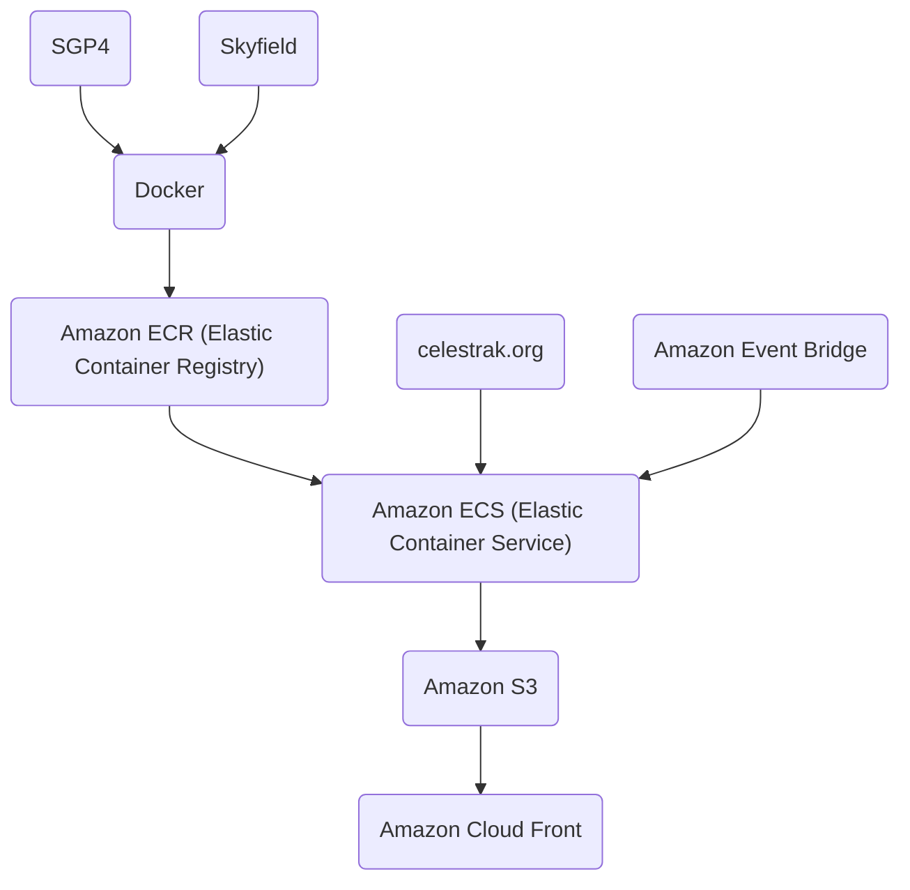
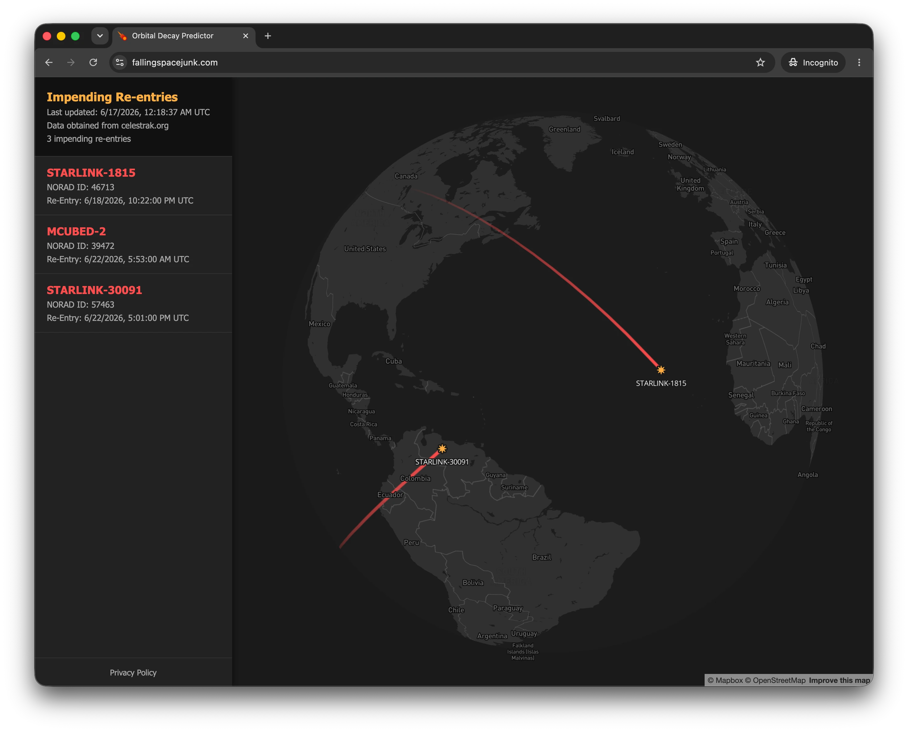
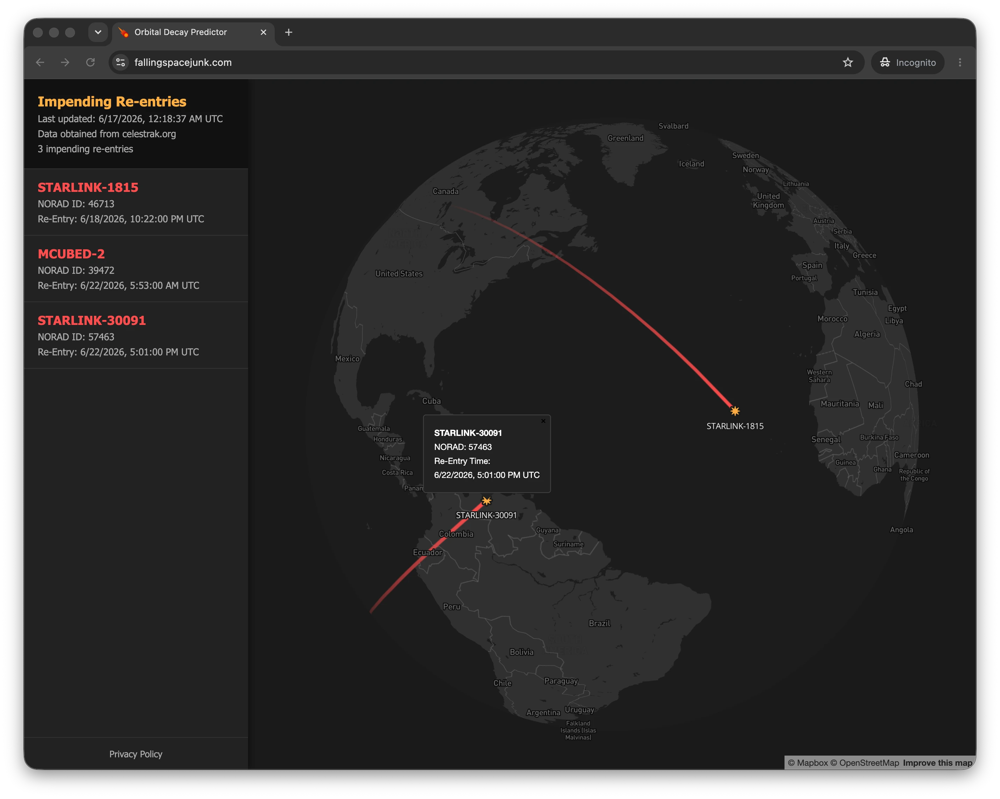
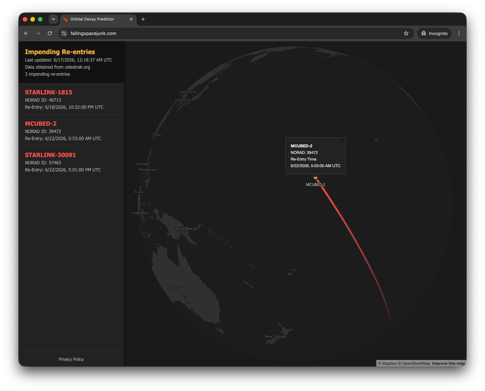

# Orbital Decay Predictor
### Visualize when and where space junk may soon de-orbit.  

# Execution

Orbital perturbation data is retrieved from [Celestrak](https://celestrak.org/) twice daily. 
The data is filtered to isolate objects in Low Earth Orbit (LEO), after which the SGP4 and Skyfield libraries are used 
to estimate their trajectories over the next seven days.

If an object’s altitude drops below the [Kármán line](https://en.wikipedia.org/wiki/K%C3%A1rm%C3%A1n_line) (100 km), 
it is flagged as having deorbited. The final 15 minutes of the object's flight path are then serialized into a 
GeoJSON file, uploaded to AWS S3, and rendered on a custom Mapbox web map.

## Architecture

## Display

# Running locally

1. `cd src`

2. `python main.py`

3. Note where the geojson file was saved, move it to the "web" directory and rename it to decays.geojson.

4. `cd ../web`

5. `python -m http.server 8000`
6. Visit http://localhost:8000/ in your web browser

# Building Docker image

1. `cd src`
2. `docker build -t orbital-decay .`

# AI Usage
I use AI tools like Claude and Gemini to brainstorm, write code, and debug.  
I don't blindly accept their output but review and modify as needed.

# Limitations
Satellites that are functioning and actively managed may not deorbit at their predicted 
time.  Operators may choose to boost the satellite's orbit.  This is especially noticeable with 
Starlink satellites - it may be predicted to decay and then be boosted into a higher orbit.  