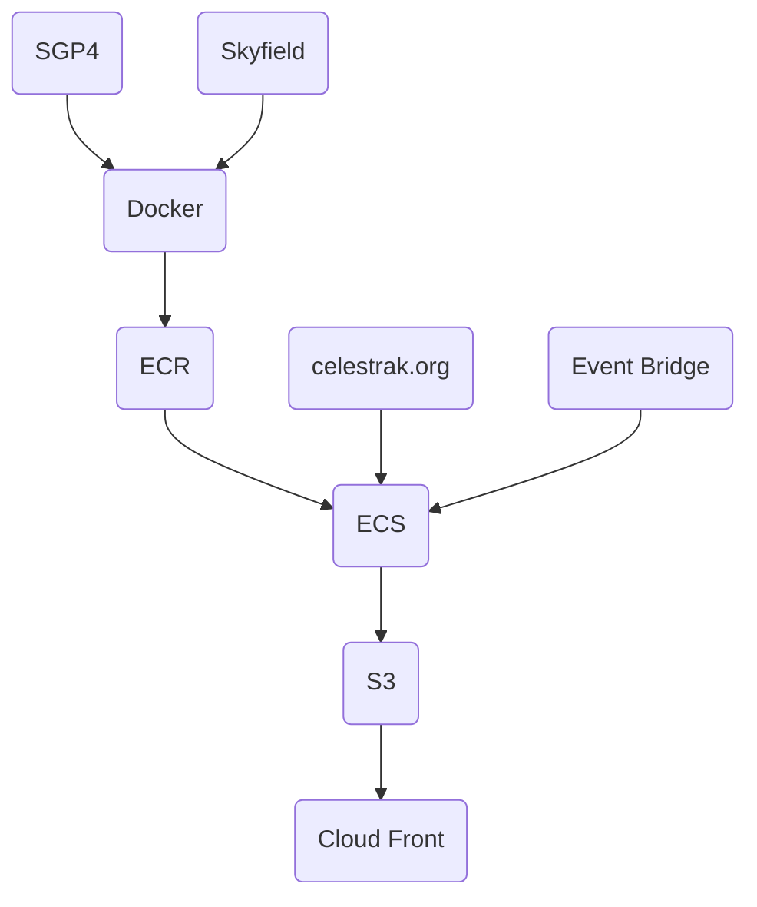

# Orbital Decay Predictor
Visualize when and where space junk will soon de-orbit

## Architecture

```mermaid
graph TD;
    SGP4(SGP4)-->Docker;
    Skyfield(Skyfield)-->Docker(Docker);
    Docker-->ECR(ECR);
    ECR-->ECS(ECS);
    ECS-->S3(S3);
    celestrak.org(celestrak.org) -->ECS(ECS);
    EventBridge(Event Bridge)-->ECS
    S3-->CloudFront(Cloud Front);
```