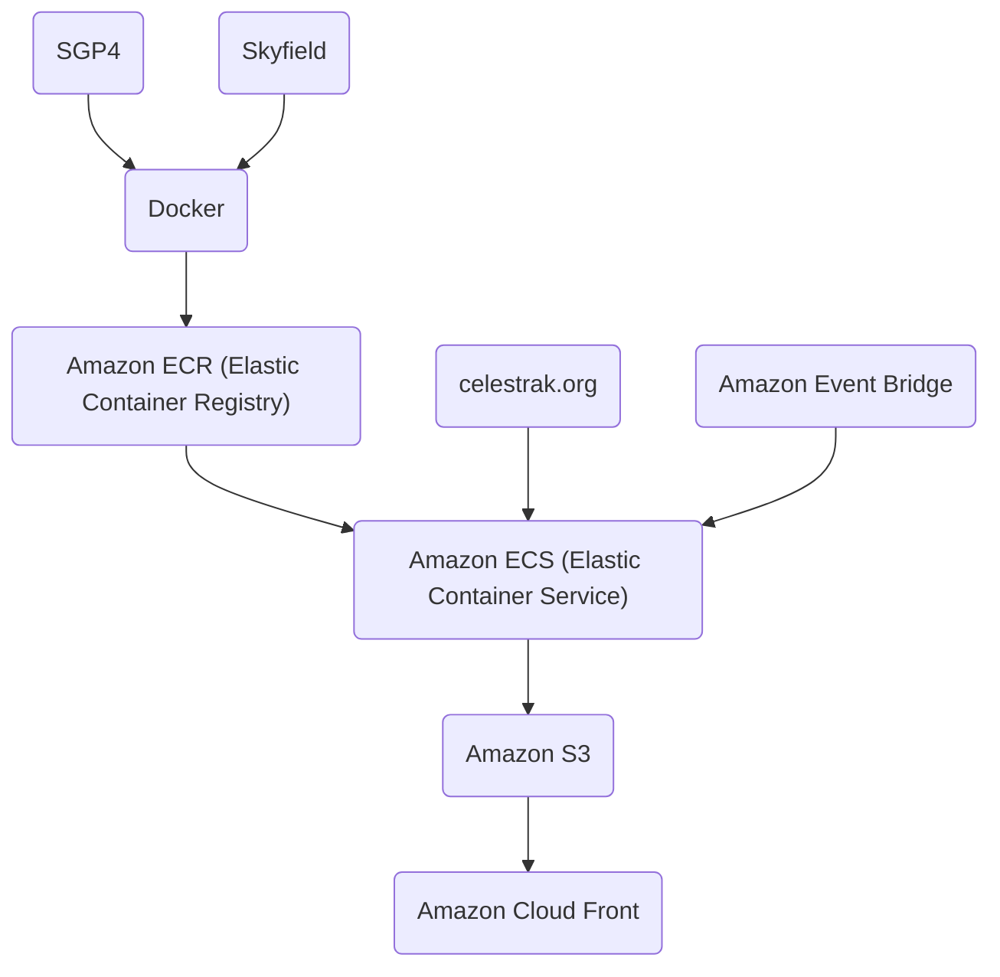

# Orbital Decay Predictor
### Visualize when and where space junk will soon de-orbit.  

# Execution

Orbital perturbation data is retrieved from [Celestrak](https://celestrak.org/) twice daily. 
The data is filtered to isolate objects in Low Earth Orbit (LEO), after which the SGP4 and Skyfield libraries are used 
to estimate their trajectories over the next seven days.

If an object’s altitude drops below the [Kármán line](https://en.wikipedia.org/wiki/K%C3%A1rm%C3%A1n_line) (100 km), 
it is flagged as having deorbited. The final 15 minutes of the object's flight path are then serialized into a 
GeoJSON file, uploaded to AWS S3, and rendered on a custom Mapbox web map.

## Architecture
