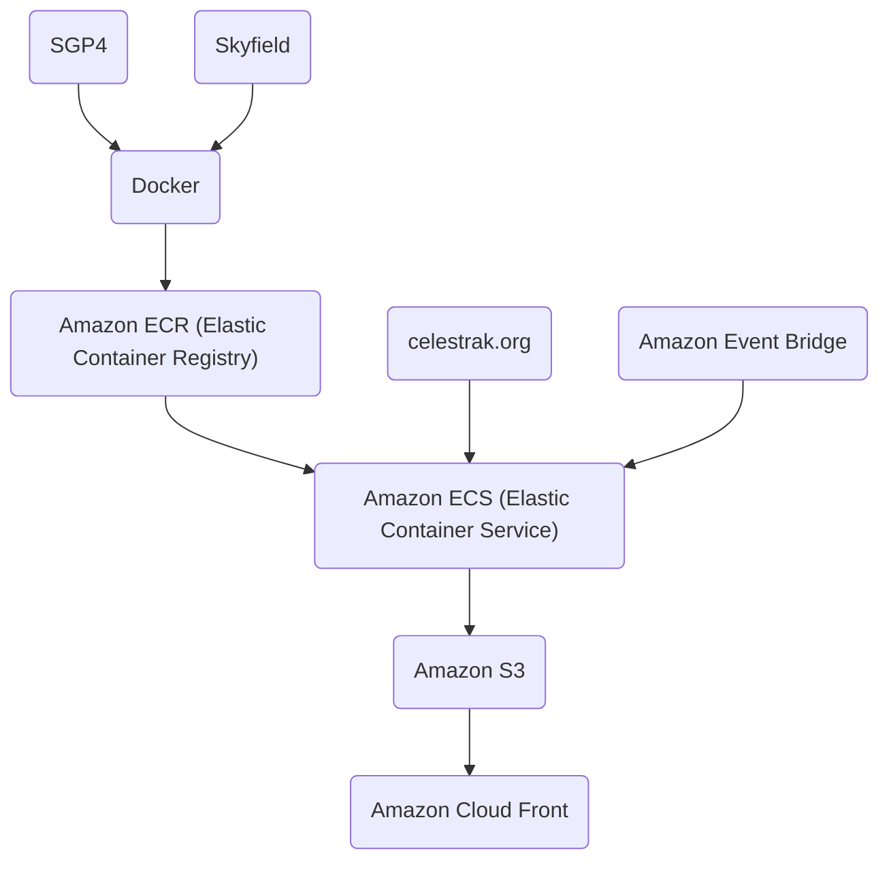
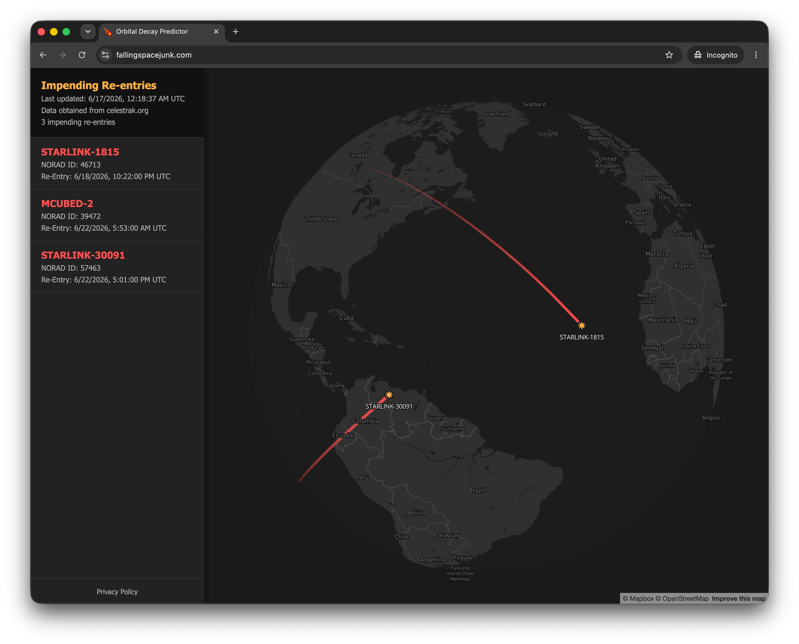
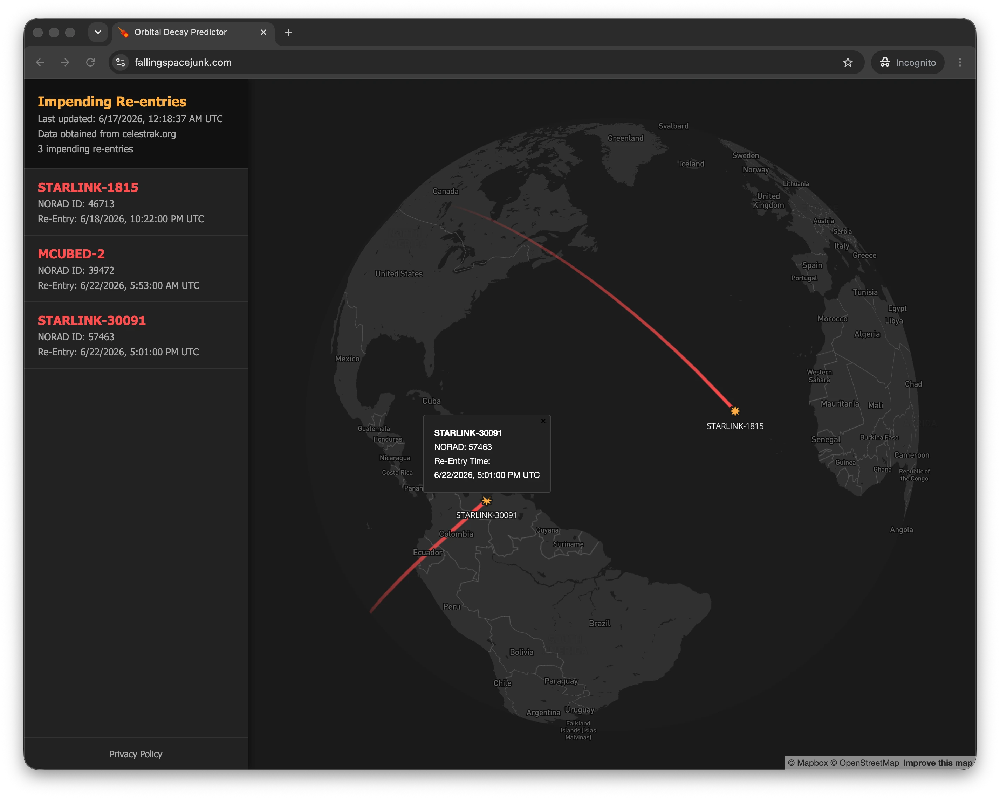
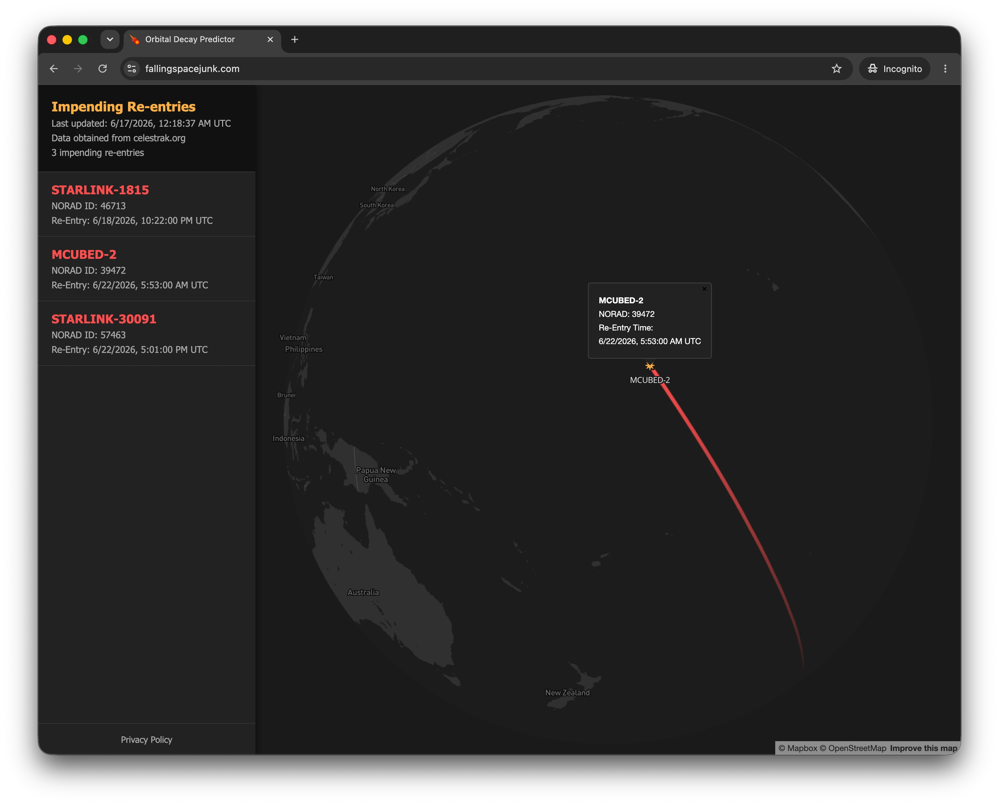

# Orbital Decay Predictor
### Visualize when and where space junk may soon de-orbit.  

# Execution

Orbital perturbation data is retrieved from [Celestrak](https://celestrak.org/) twice daily. 
The data is filtered to isolate objects in Low Earth Orbit (LEO), after which the SGP4 and Skyfield libraries are used 
to estimate their trajectories over the next seven days.

If an object’s altitude drops below the [Kármán line](https://en.wikipedia.org/wiki/K%C3%A1rm%C3%A1n_line) (100 km), 
it is flagged as having deorbited. The final 15 minutes of the object's flight path are then serialized into a 
GeoJSON file, uploaded to AWS S3, and rendered on a custom Mapbox web map.

## Architecture

```mermaid
graph TD;
    SGP4(SGP4)-->Docker;
    Skyfield(Skyfield)-->Docker(Docker);
    Docker-->ECR("Amazon ECR (Elastic Container Registry)");
    ECR-->ECS(ECS);
    ECS-->S3(Amazon S3);
    celestrak.org(celestrak.org) -->ECS("Amazon ECS (Elastic Container Service)");
    EventBridge(Amazon Event Bridge)-->ECS
    S3-->CloudFront(Amazon Cloud Front);
    click SGP4 "https://pypi.org/project/sgp4/" "Go to SGP4 documentation"
    click Skyfield "https://rhodesmill.org/skyfield/" "Go to Skyfield documentation"
    click celestrak.org "celestrak.org" "Go to celestrak.org"
```

## Display

# Running locally

1. `cd src`

2. `python main.py`

3. Note where the geojson file was saved, move it to the "web" directory and rename it to decays.geojson.

4. `cd ../web`

5. `python -m http.server 8000`
6. Visit http://localhost:8000/ in your web browser

# Building Docker image

1. `cd src`
2. `docker build -t orbital-decay .`

# Terraform
I originally built this using "click ops" and then imported into terraform. 

# CI/CD:
- GitHub actions run unit tests on every pull request.  Branch protection is enabled for `main`.  After PRs are merged, GitHub actions builds the docker container and deploys via a dedicated Terraform root module.  Images are tagged with the commit SHA, so every deployed container references its exact source. 
- Layout: Terraform is split into two root modules, `deploy` (task definition and schedule) and `infra` (IAM, ECR, S3, CloudFront) with independent state. 
- Security: 
    - Authentication is handled by OIDC, not stored long-lived AWS keys.  The trust policy only admits the `main` branch from `bkastner/orbital-decay`.
    - The deploy role is least-privilege: it can push to ECR, register a task definition, and update the EventBridge schedule but has no IAM write access and read-only access to `infra` state.
- Limitations: The `infra` stack should not be applied while the `deploy` stack is running because `deploy` reads `infra`'s outputs via remote state and that read is uncoordinated, so a concurrent change to a shared value (e.g. the task role ARN) could leave the in-flight deploy working with a stale value.

# AI Usage
I use AI tools like Claude and Gemini to brainstorm, write code, and debug.  
I don't blindly accept their output but review and modify as needed.

# Limitations
Satellites that are functioning and actively managed may not deorbit at their predicted 
time.  Operators may choose to boost the satellite's orbit.  This is especially noticeable with 
Starlink satellites - it may be predicted to decay and then be boosted into a higher orbit.  